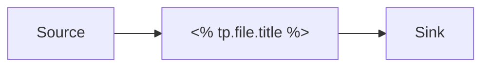

<%*
const vendor = await tp.system.prompt("Vendor (e.g. Salesforce, Snowflake, Okta)");
const category = await tp.system.prompt("Category (e.g. CRM, Data Warehouse, Identity, Messaging)");
const owner = await tp.system.prompt("Internal owner / accountable team");
const customer = await tp.system.prompt("Customer (blank for internal/generic)");
const customerLine = customer ? `customer: "[[${customer}]]"\n` : "";
-%>
---
type: system
vendor: <% vendor %>
category: <% category %>
owner: <% owner %>
status: active
<% customerLine -%>---
# <% tp.file.title %>

## Purpose

What this system does and why it exists in the architecture.

## Architecture

![[<% tp.file.title %> - Architecture.excalidraw]]

<!-- For lightweight inline diagrams use Mermaid instead, e.g.

-->

## Data Flows

Inbound and outbound data flows, refresh cadence, and volume.

## Integrations

| Connected System | Direction | Protocol | Notes |
| ---------------- | --------- | -------- | ----- |
|                  |           |          |       |

## APIs / Endpoints

- 

## Owners & Contacts

| Name | Role | Responsibility |
| ---- | ---- | -------------- |
|      |      |                |

## Notes

